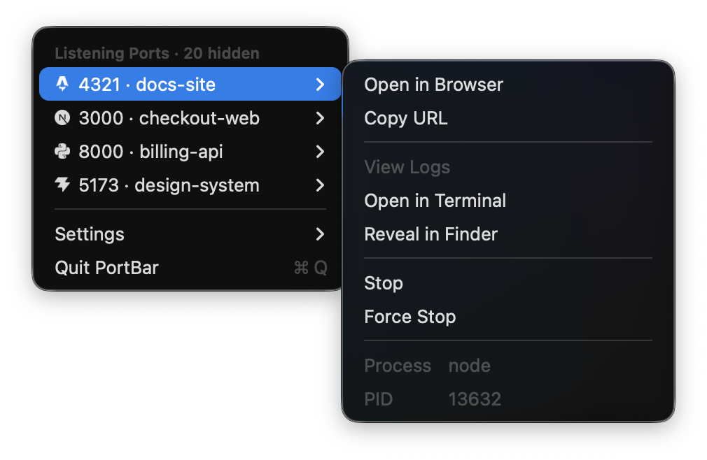

# PortBar

Every localhost port in use, in your menu bar, and one click to stop whatever is
holding one.



Built for the case where several AI coding agents have each started a dev server
and you have lost track of which is which. `lsof -i` says `node` owns port 5173.
PortBar says it is your `checkout-web` project, shows its logs, and stops it.

## Install

Download the `.dmg` from [Releases](https://github.com/robertbrada/port-bar/releases)
and drag PortBar to Applications. It is signed and notarized by Apple, so it
opens with a normal double click.

Or build it yourself, with nothing but Xcode:

```sh
git clone https://github.com/robertbrada/port-bar.git
cd port-bar
xcodebuild -project PortBar.xcodeproj -scheme PortBar -configuration Release build
```

Requires macOS 15 or later.

## Worth knowing

**There is no Dock icon and no window.** Look for the network glyph and a count
at the right of your menu bar.

**macOS will ask for Automation permission** the first time you open a browser
tab or a log window. Decline it and only those two features stop working.

**It is not on the Mac App Store, and cannot be.** Every app there must be
sandboxed, and the sandbox blocks both halves of this app's job: reading
processes it did not launch, and stopping them. That is a good reason for this
repository to be open, since you are trusting a binary that reads your process
table.

## Contributing

Issues and pull requests are welcome. [`CLAUDE.md`](CLAUDE.md) carries the design
decisions, the things tried and rejected, and the traps. Read the relevant part
before changing behaviour, because a lot of what looks arbitrary here has a
reason recorded beside it.

## Credits

Brand glyphs are [Simple Icons](https://simpleicons.org), released under CC0. The
logos remain the trademarks of their owners and imply no endorsement. See
[NOTICE](NOTICE).

## License

MIT. See [LICENSE](LICENSE).
